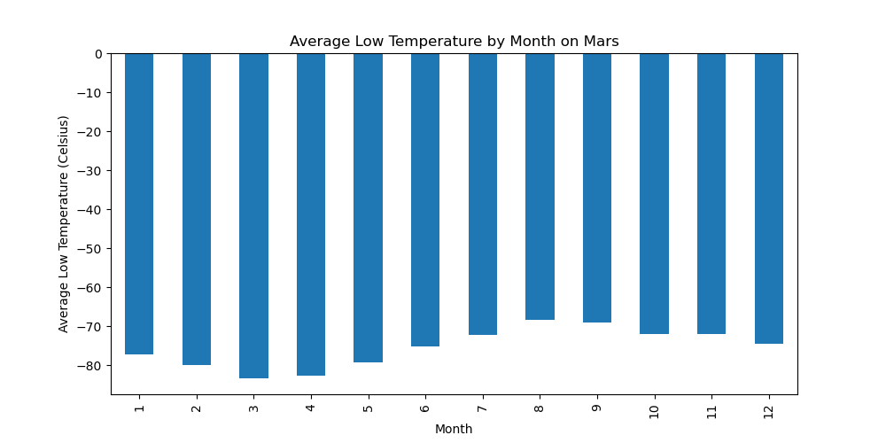
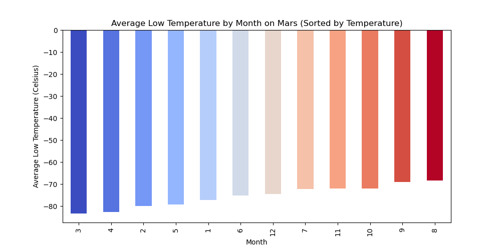
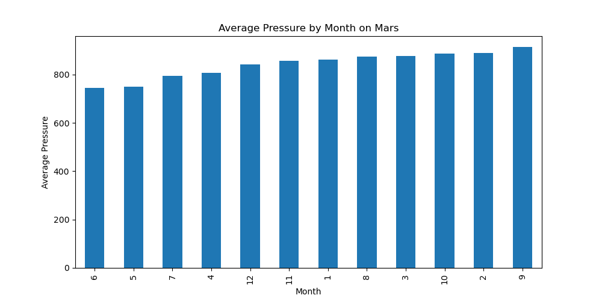
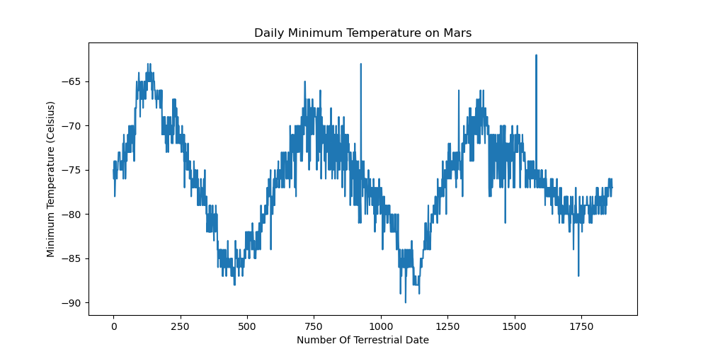

# Mars Weather Data Analysis

## Background

This project focuses on analyzing weather data for Mars. The analysis involves querying and visualizing the data, and creating a detailed report based on these queries.

## Project Structure

### Files

- `part_1_mars_news.ipynb`: Jupyter Notebook containing the Mars news data analysis.
- `part_2_mars_weather.ipynb`: Jupyter Notebook containing the Mars weather data analysis.
- `mars_weather_data.csv`: CSV file with Mars weather data.
- `daily_minimum_temperature.png`: PNG file showing the daily minimum temperature on Mars.
- `average_pressure_by_month.png`: PNG file showing the average pressure by month on Mars.
- `average_low_temperature_by_month.png`: PNG file showing the average low temperature by month on Mars.
- `average_low_temperature_by_month_sorted.png`: PNG file showing the average low temperature by month on Mars, sorted by temperature.

### Data Analysis

#### Mars News Analysis

The Mars news analysis involves:
- Scraping the latest Mars news titles and preview texts.
- Storing the scraped data in a structured format.

#### Mars Weather Analysis

The Mars weather analysis involves:
- Retrieving the weather data for Mars from the CSV file.
- Analyzing the data to find trends and patterns.
- Plotting the results.

#### Visualizations

1. **Average Low Temperature by Month on Mars**
   - 

2. **Average Low Temperature by Month on Mars (Sorted by Temperature)**
   - 

3. **Average Pressure by Month on Mars**
   - 

4. **Daily Minimum Temperature on Mars**
   - 

## Analysis Steps

1. **Mars News Analysis**
   - Scraped the latest Mars news titles and preview texts using BeautifulSoup.
   - Stored the data in a structured format for further analysis.

2. **Mars Weather Analysis**
   - Loaded the weather data from the CSV file.
   - Analyzed the data to calculate average low temperatures and pressures by month.
   - Visualized the data using Matplotlib to identify trends and patterns.

## Sources

- [BeautifulSoup Documentation](https://www.crummy.com/software/BeautifulSoup/bs4/doc/)
- [Matplotlib Documentation](https://matplotlib.org/stable/contents.html)
- [Pandas Documentation](https://pandas.pydata.org/pandas-docs/stable/)
